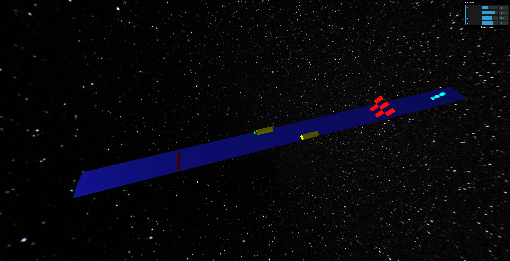

# 3d_game

### 프로젝트를 시작한 이유

- three.js를 사용하여 3d 화면를 구현해보기 위함

### 프로젝트를 하며 배운점

- THREE.js를 이용하여 다양한 도형을 생성하는 방법

- 다양한 도형을 움직이는 방법

### 실행시 CORP policy 관련 에러가 발생할 경우

- 에러가 발생할 경우 코드에서 설정해준 우주가 아닌 검정색 화면이나온다.

- 폴더를 서버에 올리기 위해 아래 명령어를 입력

```npx http-server```

이후 주소창에 서버 주소를 입력하여 실행가능 http://127.0.0.1:8080

###구현 이미지


전체적인 게임 mpa의 모양 맨 쪽부터
- 빨간 장애물은 고정
- 노랑 장애물은 좌우로 진동
- 빨간 장애물은 각각 위 아래로 진동
- 청록색 장애물은 공의 진행방향을 기준으로 회전을 함

장애물에 부딪칠 경우 fail이라는 alert가 뜬다. 
.png)

fail이라는 문구가 뜨고 난 뒤 GUI를 통해 카메라의 위치를 조절해  부딪친 부분을 볼 수 있다. 
.png)

map을 벗어나는 경우 아래로 떨어지다 일정 높이 이상 떨어지면 fail이라는 경고가 뜬다.
.png)

map의 끝에 도달 할 시 win이라는 alert가 뜬다.
.png)
